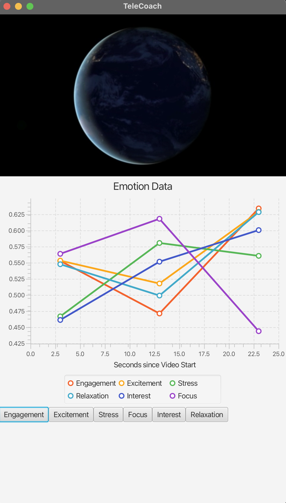

# TeleCoach: A Video Reaction Analysis App

## Instructions

* Download Java
* Open EMOTIV Launcher
    * Create a virtual device and connect to it
    * OR Connect to a real EMOTIV device
* Open a terminal at the root directory of the project: ```./gradlew run```
    * Note that the IDE build system may not work due to incompatible JDK and Kotlin versions

## Features
This application can playback video and connect to an Emotiv headset during playback and display the user's 
* Engagement
* Excitement
* Stress
* Focus
* Interest
* Relaxation

levels during video playback. This tool can be used to analyze reactions to videos or even edit videos by picking the time intervals that induced the most positive reactions. 



## Limitations
* No video selection option
* There are no video controls
* Emotion keeps compressing infinitely over time

## Documentation

### Build system:
We are using Gradle for build automation and dependency management

### Main dependencies:
* JavaFX for rendering the video and LineChart
* OpenCV for eye tracking (not included in final build due to poor performance

### Classes:

* **EmotivSocket**: (Provided by Javiergs) This class extends the WebSocketClient class and establishes a WebSocket connection to an Emotiv server. Includes methods for handling WebSocket events like opening a connection, receiving messages, and handling errors. 
* **EmotivDelegate**: (Provided by Javiergs) Class follows the CortexAPI protocol for establishing a connection with the emotiv socket. Includes methods for interacting with the Emotiv server, like requesting access, authorizing the client, retrieving user information, querying available headsets, creating a session, and subscribing to streams.
* **DanceSocket**: Class that extends EmotivSocket and overrides the onMessage method to check the server response and if not subscribed delegates the handling to DanceDelegate and if subscriped pads the LineChart. 
* **DanceDelegate**: Class that extends EmotivDelegate and overrides necessary methods for our application as well as implement basic methods to render the LineChart
* **EyeTracker**: Class that implements eye gaze tracking using OpenCV and the pretrained HaarCascade model. Not included in final build due to poor performance
* **Main**: Main class that creates the JavaFX objects necessary to render the video and graphs and integrates the Emotiv data into the application. 


